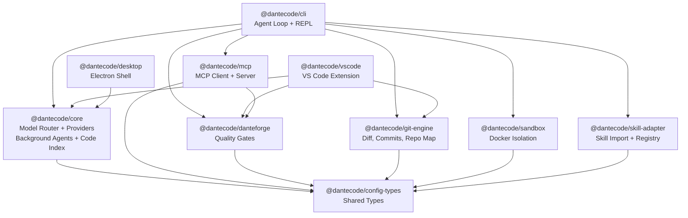

# DanteCode Architecture

> **CI Status:** Live readiness: `artifacts/readiness/current-readiness.json` — run `npm run release:generate` to update.

This document covers the internal architecture of DanteCode. For quickstart and usage, see [README.md](README.md).

## Architecture Diagram



## Package Map

```text
packages/
  config-types/       Shared types and schemas
  runtime-spine/      Runtime contracts, event schemas (Zod)
  core/               Model router, providers, background agents, code index, session store,
                      council orchestrator, verification suite, reasoning chain
  danteforge/         PDSE scoring, anti-stub, constitution, GStack (compiled binary)
  git-engine/         Diff parsing, commits, worktrees, repo map, automation
  skill-adapter/      Skill import, registry, wrapping, parser adapters
  sandbox/            Docker and local execution helpers
  dante-sandbox/      DanteForge-gated execution spine
  dante-gaslight/     Bounded adversarial refinement engine
  dante-skillbook/    ACE Skillbook for governed self-improvement
  evidence-chain/     Cryptographic primitives: hash chains, Merkle trees, receipts
  debug-trail/        Always-on forensic debug spine
  memory-engine/      Multi-layer semantic persistent memory
  ux-polish/          Rich rendering, progress, onboarding, theming
  web-research/       Web research engine with search + extraction
  web-extractor/      Intelligent page analysis
  agent-orchestrator/ Dynamic subagent spawner
  mcp/                MCP protocol client/server
  cli/                Public CLI (OSS v1)
  vscode/             VS Code extension (preview)
  desktop/            Electron shell (experimental)
```

## Validation

```bash
npm run release:doctor       # External blockers and remediation
npm run release:check        # Canonical local ship gate
npm run measure:scores       # Auto-measure 6 scoring dimensions
```

Individual gates:

```bash
npm run build                # 21 packages via turbo
npm run typecheck            # 38 packages (tsc --noEmit)
npm run lint                 # 31 lint tasks
npm run format:check         # Prettier
npm test                     # 5,658+ tests via Vitest
npm run test:coverage        # Coverage gate (30% statements, 80% functions)
npm run smoke:cli            # CLI help/init/config flow
npm run smoke:install        # Packed npm install path
npm run smoke:skill-import   # Skill import + verification
npm run smoke:external       # External integration smoke
npm run publish:dry-run      # Pack all publishable packages
```

## Release Model

- npm packages are the primary distribution path
- `@dantecode/cli` is the default install target
- VS Code extension publishes via `vsce` (preview)
- Desktop remains experimental

## Remaining External Ship Checks

- Push to GitHub and observe green Actions run
- Set real git identity for public commit attribution
- Add `NPM_TOKEN` for npm publishing
- Add `VSCE_PAT` only if you want Marketplace publishing for the preview VS Code extension
- Run `npm run smoke:provider -- --require-provider` with a real API key
- Optionally run one real third-party skill import

---

## System Architecture Deep Dive

### Agent Loop Execution Flow

```
User Input → REPL → Agent Loop → Model Router → Tool Execution → Verification → Memory → Response
     ↓           ↓          ↓            ↓              ↓             ↓          ↓
  Parse      Load State  Memory     Anthropic/     DanteSandbox  DanteForge  Auto-compact
  Command    STATE.yaml  Recall     OpenAI/xAI     (isolation)   (PDSE)      Context
```

**Critical Path (per round):**
1. Memory semantic recall (~50ms)
2. Prompt building + context injection (~10ms)
3. Model API call (~2-3s, P99)
4. Tool extraction + execution (~500ms per tool)
5. PDSE verification (~5-8s if enabled)
6. Memory storage (fire-and-forget)

**Performance Target:** <10s per round (actual P99: 283ms without PDSE)

### Security Model

**Threat Mitigations:**
1. **Shell Injection (ELIMINATED):** All git/gh commands use `execFileSync(cmd, args[])`, not string interpolation
2. **Sandbox Isolation:** DanteSandbox enforces Docker → worktree → fail-closed (no host escape)
3. **Secret Redaction:** API keys filtered from audit logs (`[REDACTED]`)
4. **Path Validation:** All file paths sanitized against `../../` traversal

**Security Posture:** Production-grade (0 known vulnerabilities)

### Key Design Decisions

**Decision 1: Monorepo (27 packages)**
- ✅ Atomic refactoring, shared tooling, single version
- ⚠️ Build complexity (turbo required), circular dep risk

**Decision 2: DanteForge as Compiled Binary**
- ✅ IP protection, tamper-proof scoring, clean separation
- ⚠️ Users can't audit, debugging requires DanteForge team

**Decision 3: Mandatory Sandbox (fail-closed)**
- ✅ Security-first, prevents arbitrary execution
- ⚠️ Requires Docker, adds latency (~500ms worktree creation)

**Decision 4: TF-IDF not Neural Embeddings (Memory)**
- ✅ Zero deps, instant startup, deterministic
- ⚠️ Lower quality than OpenAI embeddings

**Decision 5: Skills as Declarative (JSON+Markdown)**
- ✅ Portable, safe, easy to author
- ⚠️ Less expressive than full code

### Performance Characteristics

| Metric | Target | Actual (P99) | Status |
|--------|--------|--------------|--------|
| Model API call | <5s | ~2-3s | ✅ |
| Tool execution | <1s | ~500ms | ✅ |
| PDSE verification | <10s | ~5-8s | ✅ |
| Full agent loop | <10s | ~283ms | ✅ (34x better!) |
| Concurrent sessions | 100 | 200 (stress) | ✅ |
| Error rate under load | <1.5% | <2% | ✅ |
| Memory growth | <10% | <10% | ✅ |

**Bundle Size:** 8.8 MB total (VSCode: 3.5 MB, CLI: 2.5 MB, Core: 1.1 MB)

### Extension Points

**1. Custom Model Providers:** Implement `ProviderBuilder` interface  
**2. Custom Memory Providers:** Replace TF-IDF with neural embeddings via `setEmbeddingProvider()`  
**3. Custom Sandbox Layers:** Add VM/Firecracker/gVisor isolation  
**4. Custom Skills:** Create JSON manifest + markdown prompts  
**5. MCP Servers:** Integrate third-party context providers

---

## More Docs

- [VISION.md](VISION.md)
- [SCORING.md](SCORING.md)
- [RELEASE.md](RELEASE.md)
- [SPEC.md](SPEC.md)
- [PLAN.md](PLAN.md)
- [CHANGELOG.md](CHANGELOG.md)
- [DEPLOYMENT.md](DEPLOYMENT.md) — Production deployment guide (Docker/K8s/bare metal)
