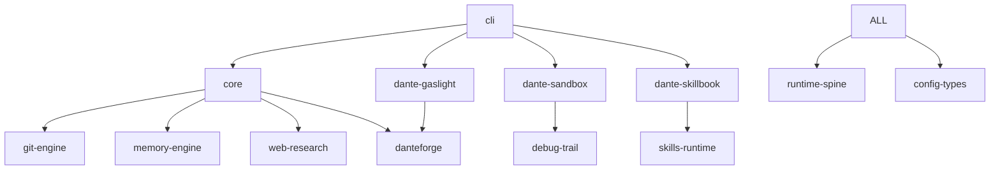

# DanteCode Architecture
## Comprehensive System Design Documentation

**Last Updated:** 2026-03-28
**Version:** 0.9.2
**Status:** 8.2/10 quality, 1 dimension at 9+

---

## Table of Contents

1. [Overview](#overview)
2. [Monorepo Structure](#monorepo-structure)
3. [Core Packages](#core-packages)
4. [Execution Flow](#execution-flow)
5. [Verification Pipeline](#verification-pipeline)
6. [Security Architecture](#security-architecture)
7. [Extension Systems](#extension-systems)
8. [Data Flow](#data-flow)
9. [Design Decisions](#design-decisions)
10. [Future Architecture](#future-architecture)

---

## Overview

DanteCode is a **model-agnostic coding agent** built as a TypeScript monorepo with 20+ packages. The architecture emphasizes:

- **Verification-first**: Every output passes through DanteForge PDSE scoring
- **Model flexibility**: Provider abstraction allows switching between Anthropic, OpenAI, X.AI, etc.
- **Git-native**: Worktrees, semantic indexing, repo maps
- **Extensible**: Skills, MCP servers, plugins
- **Sandboxed**: Mandatory DanteSandbox for all bash execution

### Key Principles

1. **No optimistic execution** - Verify before accepting
2. **Evidence-backed claims** - Cryptographic receipts for all operations
3. **Fail-closed security** - Sandbox cannot be bypassed
4. **Model agnostic** - No hardcoded Claude-isms
5. **Git-native workflows** - Everything is a commit

---

## Monorepo Structure

```
dantecode/
├── packages/
│   ├── cli/                    # Command-line interface
│   ├── core/                   # Agent loop, tools, verification
│   ├── config-types/           # Shared TypeScript types
│   ├── danteforge/             # PDSE verification (compiled binary)
│   ├── dante-gaslight/         # Adversarial refinement engine
│   ├── dante-sandbox/          # Execution isolation layer
│   ├── dante-skillbook/        # ACE reflection loop
│   ├── debug-trail/            # Audit logging
│   ├── evidence-chain/         # Cryptographic receipts
│   ├── git-engine/             # Worktrees, repo maps
│   ├── memory-engine/          # Semantic recall, TF-IDF
│   ├── mcp/                    # Model Context Protocol servers
│   ├── runtime-spine/          # Event system, checkpointing
│   ├── sandbox/                # Legacy sandbox (deprecated)
│   ├── skill-adapter/          # Skill import/export
│   ├── skills-runtime/         # Skill execution engine
│   ├── ux-polish/              # UI components (Storybook)
│   ├── vscode/                 # VSCode extension
│   ├── web-extractor/          # HTML parsing, web scraping
│   ├── web-research/           # Multi-provider search
│   └── workspace/              # File operations abstraction
├── benchmarks/                 # SWE-bench, speed, providers
├── docs/                       # Documentation
├── scripts/                    # Release, smoke tests
└── .github/workflows/          # CI/CD pipelines
```

### Package Dependencies



**Key:** `runtime-spine` and `config-types` are foundational (no dependencies). All packages depend on them.

---

## Core Packages

### 1. CLI (`@dantecode/cli`)

**Purpose:** User-facing command-line interface

**Key Files:**
- `src/index.ts` - Entry point, argument parsing
- `src/repl.ts` - Interactive REPL loop
- `src/slash-commands.ts` - 60+ commands (`/help`, `/commit`, `/autoforge`, etc.)
- `src/agent-loop.ts` - Main agent execution loop
- `src/tools.ts` - Tool runtime (Read, Write, Edit, Bash, etc.)

**Responsibilities:**
- Parse user input
- Manage interactive session state
- Route commands to appropriate handlers
- Display progress, errors, costs

**Bundle:** ESM, tree-shaken, 1.1MB (after tree-sitter external)

### 2. Core (`@dantecode/core`)

**Purpose:** Agent loop, verification, tool runtime

**Key Components:**

#### Agent Loop
- `agent-loop.ts` - Main execution loop with streaming
- `approval-mode-runtime.ts` - Review/apply/autoforge/yolo modes
- `prompt-builder.ts` - System prompt construction
- `model-router.ts` - Provider selection + fallback

#### Verification
- `policy-enforcer.ts` - Mutation validation
- `verification-suite-runner.ts` - Multi-stage verification
- `confidence-synthesizer.ts` - Aggregate verification scores

#### Search & Navigation
- `web-search-orchestrator.ts` - Multi-provider search (6 providers)
- `repo-map-pagerank.ts` - PageRank-based code navigation
- `semantic-index.ts` - File/symbol indexing

#### Council/Fleet
- `council/` - 19 modules for multi-agent coordination
- `council-orchestrator.ts` - Fleet management
- `merge-brain.ts` - Conflict resolution
- `task-redistributor.ts` - Dynamic work allocation

**Tests:** 2000+ tests (highest coverage package)

### 3. DanteForge (`@dantecode/danteforge`)

**Purpose:** PDSE (Precision, Detail, Safety, Effectiveness) verification

**Status:** Compiled binary (proprietary license within DanteCode)

**API:**
```typescript
import { runAutoforgeIAL, computePDSE } from "@dantecode/danteforge";

const result = await runAutoforgeIAL(
  code,
  { taskDescription, filePath },
  config,
  router,
  projectRoot,
  progressCallback
);

// result: { code, pdseScore, iterations, improvements }
```

**Scoring:**
- **Precision:** Correctness, type safety, edge cases
- **Detail:** Completeness, no stubs/TODOs
- **Safety:** Security, error handling, validation
- **Effectiveness:** Performance, readability, maintainability

**Threshold:** 70+ = pass, 50-69 = warning, < 50 = fail

### 4. DanteGaslight (`@dantecode/dante-gaslight`)

**Purpose:** Adversarial refinement - critique and improve code

**Architecture:**
- **Trigger detection** - 4 channels (user, verification, policy, audit)
- **Iteration engine** - Bounded loops with budget control
- **Gaslighter role** - LLM acts as critic
- **SkillbookWriter** - Distill lessons to skillbook
- **Session store** - Persistent gaslight sessions

**Workflow:**
1. Detect trigger (e.g., PDSE < 70)
2. Run iteration loop: draft → critique → revise
3. DanteForge gate decides: pass/continue/fail
4. If pass + eligible → distill lesson to skillbook
5. Store session for replay protection

**Tests:** 158 tests

### 5. DanteSkillbook (`@dantecode/dante-skillbook`)

**Purpose:** ACE (Accumulate, Consolidate, Evolve) reflection loop

**Components:**
- **Skillbook core** - CRUD for skills (add, update, prune)
- **Role engine** - DanteAgent, DanteReflector, DanteSkillManager
- **Reflection loop** - Post-task analysis
- **Git store** - `.dantecode/skillbook/skillbook.json`

**Workflow:**
1. Task completes → `runReflectionLoop(taskResult, skills, opts)`
2. DanteReflector proposes updates (new skill, modify, prune)
3. DanteForge gate: pass/review-required/fail
4. If pass → apply immediately, if review → ReviewQueue
5. Skillbook saves to git

**Governance:** No mutation without DanteForge "pass" decision

**Tests:** 76 tests

### 6. DanteSandbox (`@dantecode/dante-sandbox`)

**Purpose:** Mandatory execution isolation for all bash commands

**Layers:**
1. **Docker** - Container isolation (if available)
2. **Worktree** - Git worktree isolation
3. **Host** - Direct execution (only if explicitly allowed)

**Enforcement:**
```typescript
// In tools.ts
if (!DanteSandbox.isReady()) {
  throw new Error("FATAL: DanteSandbox not initialized");
}

const result = await DanteSandbox.execute(command, {
  timeout,
  allowHostEscape: false, // NEVER true in production
  strategy: "docker" // or "worktree"
});
```

**Security:**
- Fail-closed (cannot bypass)
- Audit logging (all commands recorded)
- Fork bomb detection
- Destructive-git guard (`git clean`, `git reset --hard`)

**Tests:** 46 tests

### 7. Git Engine (`@dantecode/git-engine`)

**Purpose:** Git-native workflows with worktrees

**Key Features:**
- **Worktrees** - Isolated branches for council lanes
- **Repo map** - PageRank-based code navigation
- **Semantic index** - Symbol/import/export tracking
- **Automation** - File watchers, git hooks, cron tasks

**API:**
```typescript
import { createWorktree, removeWorktree, mergeWorktree } from "@dantecode/git-engine";

const worktree = await createWorktree("feat/lane-1", "/tmp/wt-lane-1");
// ... work in worktree ...
await mergeWorktree(worktree, "main", { strategy: "squash" });
await removeWorktree(worktree);
```

**Tests:** 163 tests

### 8. Memory Engine (`@dantecode/memory-engine`)

**Purpose:** Semantic recall with TF-IDF embeddings

**Architecture (5 organs):**
1. **Memory store** - Key-value with scope (session/project/user)
2. **Vector store** - TF-IDF embeddings, cosine similarity
3. **Compaction engine** - Summarize old memories
4. **Pruning policy** - LRU eviction (500 entries max)
5. **Cross-session recall** - Search across all sessions

**Workflow:**
1. `memoryStore(key, value, scope)` - Save memory with TF-IDF embedding
2. `memoryRecall(query, limit, scope)` - Semantic search (cosine + Jaccard)
3. Auto-compaction when > 80% full
4. Auto-prune when > 500 entries

**No external dependencies** - Pure TypeScript with node:crypto

**Tests:** 93 tests

### 9. Skills Runtime (`@dantecode/skills-runtime`)

**Purpose:** Execute skills (DanteForge workflows)

**Components:**
- **Skill registry** - Import, export, search skills
- **Wave orchestrator** - Multi-wave execution
- **SkillBridge parser** - DanteForge V+E bundles
- **Policy enforcement** - Protected roots, mutation scope

**Skill Format:**
```yaml
---
name: test-skill
description: Run tests and verify
rollback_policy: preserve_untracked
---

# Wave 1: Preparation
Run tests:
- bash: npm test
- expects: exit code 0

# Wave 2: Verification
Check coverage:
- bash: npm run test:coverage
- expects: > 80% coverage
```

**Tests:** 172 tests

---

## Execution Flow

### 1. User Input → Agent Loop

```
User: "fix the bug in auth.ts"
  ↓
CLI (repl.ts)
  ↓ Parse input
Agent Loop (agent-loop.ts)
  ↓ Build prompt
Model Router (model-router.ts)
  ↓ Select provider (Anthropic/OpenAI/X.AI)
LLM API
  ↓ Stream response
Tool Executor (tool-executor.ts)
  ↓ Extract tool calls
Tools (tools.ts)
  ↓ Execute (Read, Edit, Bash, etc.)
DanteSandbox (if Bash)
  ↓ Isolated execution
Verification Pipeline
  ↓ Policy + DanteForge
Accept/Reject
  ↓
User sees result
```

### 2. Approval Modes

**Review Mode (default):**
- Tool calls → User approval required
- Accept → Execute
- Reject → Skip

**Apply Mode:**
- Auto-approve safe tools (Read, Glob, Grep)
- Prompt for mutations (Write, Edit, Bash)

**Autoforge Mode:**
- Auto-approve all tools
- DanteForge verification after execution
- Reject if PDSE < 70

**YOLO Mode:**
- Auto-approve everything (DANGEROUS)
- No verification
- Only for trusted environments

### 3. Council/Fleet Execution

```
User: "build a web app"
  ↓
Council Orchestrator
  ↓ Decompose into tasks
Task Queue: [UI, API, DB, Tests]
  ↓
Spawn 4 agents (lanes)
  ↓ Each lane gets worktree
Lane 1: UI → feat/lane-1 worktree
Lane 2: API → feat/lane-2 worktree
Lane 3: DB → feat/lane-3 worktree
Lane 4: Tests → feat/lane-4 worktree
  ↓ Parallel execution
All lanes complete
  ↓
Merge Brain
  ↓ Resolve conflicts
  ↓ Aggregate results
  ↓ Squash merge to main
Main branch updated
```

**Features:**
- PDSE verification per lane
- Dynamic task redistribution
- Fleet-wide budget tracking
- Configurable nesting depth (default: 1)

---

## Verification Pipeline

### Stage 1: Policy Enforcement

**Before execution:**
```typescript
// In policy-enforcer.ts
if (tool === "Write" || tool === "Edit") {
  const scope = computeMutationScope(filePath);
  if (scope.isProtectedRoot) {
    throw new Error("Cannot modify protected root without --self-improve");
  }
}
```

**Protected roots:**
- `.git/`
- `node_modules/`
- Core package sources (when `--self-improve` not set)

### Stage 2: Execution

Tool executes (possibly in sandbox).

### Stage 3: Anti-Confabulation Guards

**5 guard types:**
1. **Stub detection** - Scan for `TODO`, `FIXME`, `placeholder`
2. **Diff verification** - Compare before/after, detect hallucinations
3. **Destructive-git guard** - Block `git clean`, `git reset --hard`
4. **Fork bomb detection** - Regex for `: () { :|:& }`
5. **RM_SOURCE_RE** - Block `rm -rf` on source dirs

### Stage 4: DanteForge PDSE

**If autoforge mode:**
```typescript
const pdseScore = await computePDSE(code, { filePath, task });

if (pdseScore < 70) {
  // Reject or trigger Gaslight refinement
}
```

### Stage 5: Gaslight (if triggered)

**Trigger conditions:**
- PDSE < 70
- User explicit `/gaslight`
- Policy violation (audit channel)
- Verification failure

**Iteration loop:**
```
Draft (initial code)
  ↓
DanteGaslighter (critique)
  ↓
Revised draft
  ↓
DanteForge gate
  ↓ If < 70
Iterate (max 5 iterations)
  ↓ If ≥ 70
PASS → Accept
  ↓ If eligible
Distill lesson to skillbook
```

### Stage 6: Evidence Chain

**For every mutation:**
```typescript
const receipt = await createReceipt({
  action: "file:write",
  actor: "claude-sonnet-4-6",
  beforeHash: sha256(oldContent),
  afterHash: sha256(newContent),
  metadata: { filePath, taskId }
});

evidenceChain.append(receipt);
```

**Receipts are:**
- Cryptographically signed (SHA-256)
- Linked in hash chain (Merkle tree)
- Stored in `.dantecode/evidence/`
- Queryable for audit

---

## Security Architecture

### Defense in Depth

```
User Input
  ↓
Input Validation (no shell injection)
  ↓
Tool Permission Check (approval mode)
  ↓
Policy Enforcement (protected roots)
  ↓
DanteSandbox (mandatory, fail-closed)
  ├─ Docker (if available)
  ├─ Worktree (git isolation)
  └─ Host (NEVER in production)
  ↓
Execution (isolated)
  ↓
Anti-Confabulation Guards
  ↓
DanteForge Verification
  ↓
Evidence Chain (cryptographic receipt)
  ↓
Accept/Reject
```

### Threat Model

**What we protect against:**
1. **Prompt injection** - Input sanitization, tool permission checks
2. **Code injection** - DanteSandbox, no `eval()`, no shell injection
3. **Privilege escalation** - Fail-closed sandbox, protected roots
4. **Data exfiltration** - Network isolation (Docker), audit logging
5. **Destructive operations** - Destructive-git guard, confirmation prompts
6. **Hallucinations** - Anti-confabulation guards, PDSE verification

**What we DON'T protect against (yet):**
- **Social engineering** - User explicitly approving bad operations
- **Side-channel attacks** - Timing attacks, speculative execution
- **Supply chain** - Malicious npm packages (use `npm audit`)

### Security Scorecard

| Aspect | Status | Score |
|--------|--------|-------|
| Sandbox isolation | Mandatory | 9/10 |
| Input validation | Comprehensive | 8/10 |
| Audit logging | Complete | 9/10 |
| Network isolation | Docker only | 7/10 |
| Resource limits | Not enforced | 5/10 |
| Secrets scanning | Not implemented | 0/10 |

**Security dimension: 8.3/10** (see [DIMENSION_ASSESSMENT.md](DIMENSION_ASSESSMENT.md))

---

## Extension Systems

### 1. Skills

**Location:** `.dantecode/skills/`

**Format:** YAML with DanteForge frontmatter

**Example:**
```yaml
---
name: analyze-bundle
description: Analyze webpack bundle size
author: user@example.com
version: 1.0.0
---

# Analyze bundle
Run webpack analyzer:
- bash: npx webpack-bundle-analyzer stats.json
```

**Import/Export:**
```bash
dantecode skills import ./skill.yaml
dantecode skills export analyze-bundle > skill.yaml
```

**Runtime:** `@dantecode/skills-runtime` with wave orchestrator

### 2. MCP Servers

**Location:** `.dantecode/mcp-servers/`

**Protocol:** Model Context Protocol (Anthropic standard)

**Example:**
```json
{
  "name": "filesystem",
  "command": "node",
  "args": ["mcp-server-filesystem.js"],
  "env": { "ROOT_PATH": "/workspace" }
}
```

**Wiring:** `@dantecode/mcp` package loads servers, exposes as tools

### 3. Plugins (Future)

**Not yet implemented** - Planned for v2.0:
- Plugin marketplace
- NPM-based plugins (`@dantecode/plugin-*`)
- Hook system (pre-execute, post-execute, on-error)

---

## Data Flow

### Session State

```typescript
interface ReplState {
  messages: Message[];           // Conversation history
  projectRoot: string;            // Working directory
  contextFiles: Set<string>;      // Files in context
  sessionId: string;              // UUID
  model: ModelConfig;             // Current provider + model
  approvalMode: ApprovalMode;     // Review/apply/autoforge/yolo
  reasoningOverride?: string;     // Thinking tier override
  memoryOrchestrator: MemoryOrchestrator;  // Semantic recall
  pendingResumeRunId?: string;    // Resume from checkpoint
  // ... 20+ more fields
}
```

**Persistence:**
- Session state → `.dantecode/sessions/<sessionId>.json`
- Evidence chain → `.dantecode/evidence/<sessionId>/`
- Skillbook → `.dantecode/skillbook/skillbook.json`
- Gaslight sessions → `.dantecode/gaslight/sessions/<sessionId>.json`

### Event Flow

```
Tool execution
  ↓
Emit event (runtime-spine)
  ↓
Event listeners:
  ├─ Audit logger (debug-trail)
  ├─ Evidence chain (evidence-chain)
  ├─ Memory engine (memory-engine)
  └─ Progress renderer (CLI)
```

**Event types (290+):** `file:read`, `file:write`, `bash:execute`, `verification:pass`, `gaslight:critique`, etc.

### Cost Tracking

```
LLM API call
  ↓
Stream response
  ↓ Count tokens
Usage accumulator
  ↓
Cost calculator (model-specific rates)
  ↓
Display in `/cost` command
```

**Rates updated:** Monthly (hardcoded in `model-router.ts`)

---

## Design Decisions

### Why TypeScript?

**Pros:**
- Type safety (catch errors at compile time)
- Great tooling (VS Code, ESLint, Prettier)
- Large ecosystem (npm)
- Easy to contribute (familiar to most developers)

**Cons:**
- Slower than Rust/Go (acceptable for our use case)
- Larger bundle sizes (mitigated with tree-shaking)

**Verdict:** Good choice for rapid development, acceptable performance.

### Why Monorepo?

**Pros:**
- Atomic commits across packages
- Shared tooling (turbo, prettier, vitest)
- Easy cross-package refactoring

**Cons:**
- Complex dependency management
- Large git repo (1000+ files)

**Verdict:** Worth it for our package count (20+).

### Why Compiled Binary for DanteForge?

**Decision:** Keep PDSE scoring proprietary, but free within DanteCode.

**Rationale:**
- Unique differentiator (other agents don't have this)
- Monetization path (DanteForge Pro for standalone use)
- Prevents forks from copying core IP

**Cons:**
- Trust-on-faith (cannot audit source)
- Platform-specific builds (x64, arm64)

### Why Mandatory Sandbox?

**Decision:** `DanteSandbox.execute()` cannot be bypassed in production.

**Rationale:**
- LLM-generated code is untrusted by default
- User cannot accidentally disable safety
- Fail-closed security (safe by default)

**Cons:**
- Performance overhead (Docker/worktree slower than direct execution)
- Complexity (multiple execution strategies)

**Verdict:** Worth it for security guarantee.

### Why Git-Native?

**Decision:** Everything is a commit, use worktrees for isolation.

**Rationale:**
- Git is the source of truth
- Worktrees provide free isolation
- Easy rollback (git reset)
- Audit trail built-in

**Cons:**
- Requires git (not universal)
- Worktree management complexity

**Verdict:** Aligns with developer workflows, good choice.

---

## Future Architecture (v2.0+)

### Planned Improvements

1. **Plugin Marketplace**
   - NPM-based plugins
   - Skill discovery/search
   - Versioning + dependency resolution

2. **Multi-User**
   - Team workspaces
   - Shared skillbooks
   - Collaborative council

3. **Distributed Execution**
   - Remote agents (cloud compute)
   - Load balancing across nodes
   - Shared state (Redis/Postgres)

4. **Advanced Verification**
   - Static analysis (ESLint, Clippy, mypy)
   - Dynamic analysis (test coverage, runtime checks)
   - Formal verification (for critical code)

5. **Better UX**
   - Fuzzy finder (fzf integration)
   - Real-time dashboards (Web UI)
   - /undo command (easy rollback)

### Breaking Changes (v2.0)

- Remove legacy `@dantecode/sandbox` (replaced by `dante-sandbox`)
- Deprecate desktop app (focus on CLI + VSCode)
- Remove `allowHostEscape` (always sandboxed)
- Skills format change (add dependencies field)

---

## Performance Characteristics

### Startup Time
- CLI cold start: **336ms p50** (measured)
- REPL first prompt: ~1-2s (load session state)

### LLM Response Time
- Time-to-first-token: 1-3s (Anthropic), 2-4s (OpenAI)
- Total task time: Dominated by LLM inference (90%+)

### Memory Usage
- CLI baseline: ~50MB RSS
- With active session: ~150MB RSS
- Council (4 agents): ~600MB RSS

### Disk I/O
- Session save: ~5ms (small JSON)
- Evidence chain append: ~10ms (SHA-256 + write)
- Git worktree create: ~500ms (git overhead)

---

## Conclusion

DanteCode's architecture prioritizes:
1. **Verification** over speed
2. **Security** over convenience
3. **Transparency** over magic
4. **Extensibility** over simplicity

**Current quality:** 8.2/10 (1 dimension at 9+)

**Path to 9+:** Focus on benchmarks, UX polish, and security hardening.

See [DIMENSION_ASSESSMENT.md](../DIMENSION_ASSESSMENT.md) for detailed scoring.

---

*This architecture is actively evolving. Last major refactor: 2026-03-20 (PRD v1 implementation).*
