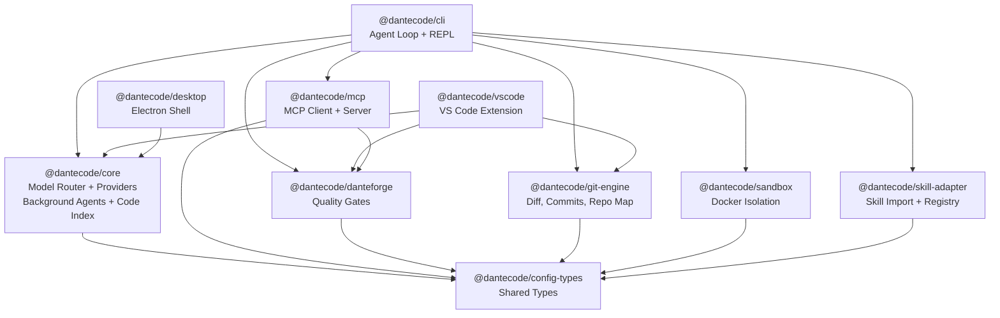

# DanteCode Architecture

This document covers the internal architecture of DanteCode. For quickstart and usage, see [README.md](README.md).

## Architecture Diagram



## Package Map

```text
packages/
  config-types/       Shared types and schemas
  runtime-spine/      Runtime contracts, event schemas (Zod)
  core/               Model router, providers, background agents, code index, session store,
                      council orchestrator, verification suite, reasoning chain
  danteforge/         PDSE scoring, anti-stub, constitution, GStack (compiled binary)
  git-engine/         Diff parsing, commits, worktrees, repo map, automation
  skill-adapter/      Skill import, registry, wrapping, parser adapters
  sandbox/            Docker and local execution helpers
  dante-sandbox/      DanteForge-gated execution spine
  dante-gaslight/     Bounded adversarial refinement engine
  dante-skillbook/    ACE Skillbook for governed self-improvement
  evidence-chain/     Cryptographic primitives: hash chains, Merkle trees, receipts
  debug-trail/        Always-on forensic debug spine
  memory-engine/      Multi-layer semantic persistent memory
  ux-polish/          Rich rendering, progress, onboarding, theming
  web-research/       Web research engine with search + extraction
  web-extractor/      Intelligent page analysis
  agent-orchestrator/ Dynamic subagent spawner
  mcp/                MCP protocol client/server
  cli/                Public CLI (OSS v1)
  vscode/             VS Code extension (preview)
  desktop/            Electron shell (experimental)
```

## Validation

```bash
npm run release:doctor       # External blockers and remediation
npm run release:check        # Canonical local ship gate
npm run measure:scores       # Auto-measure 6 scoring dimensions
```

Individual gates:

```bash
npm run build                # 21 packages via turbo
npm run typecheck            # 38 packages (tsc --noEmit)
npm run lint                 # 31 lint tasks
npm run format:check         # Prettier
npm test                     # 5,658+ tests via Vitest
npm run test:coverage        # Coverage gate (30% statements, 80% functions)
npm run smoke:cli            # CLI help/init/config flow
npm run smoke:install        # Packed npm install path
npm run smoke:skill-import   # Skill import + verification
npm run smoke:external       # External integration smoke
npm run publish:dry-run      # Pack all publishable packages
```

## Release Model

- npm packages are the primary distribution path
- `@dantecode/cli` is the default install target
- VS Code extension publishes via `vsce` (preview)
- Desktop remains experimental

## Remaining External Ship Checks

- Push to GitHub and observe green Actions run
- Set real git identity for public commit attribution
- Add `NPM_TOKEN` and `VSCE_PAT` secrets for publishing
- Run `npm run smoke:provider -- --require-provider` with a real API key
- Optionally run one real third-party skill import

## More Docs

- [VISION.md](VISION.md)
- [SCORING.md](SCORING.md)
- [RELEASE.md](RELEASE.md)
- [SPEC.md](SPEC.md)
- [PLAN.md](PLAN.md)
- [CHANGELOG.md](CHANGELOG.md)
