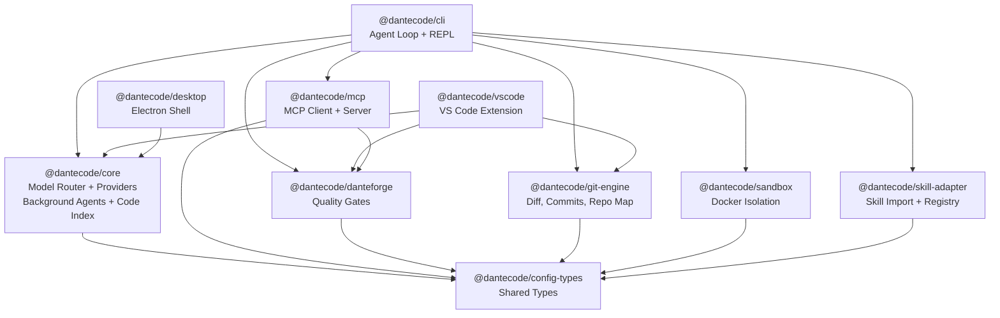

# DanteCode

[](https://github.com/dantericardo88/dantecode/actions/workflows/ci.yml)
[](https://www.npmjs.com/package/@dantecode/cli)
[](LICENSE)
[](https://nodejs.org)

DanteCode is a portable, model-agnostic skill runtime and coding agent.

Grok is the default provider, not the product identity. The real product center is interoperability: bringing reusable coding workflows and Claude-style skills into a verification-first runtime that does not lock developers to a single model vendor.

**DanteForge** is the verification engine behind DanteCode. It runs the anti-stub gate, PDSE scoring, constitution checks, and GStack validation so imported or generated workflows have to earn trust before they land.

DanteCode ships with the full DanteForge engine compiled in — no stubs, no feature gates, no limits. The complete experience is free and open source.

**Want DanteForge in your Claude Code, Cursor, or Aider workflow?** [Get DanteForge Pro](https://dantecode.dev/pro) — the standalone engine for any tool.

## OSS v1 status

- CLI: GA ship target for Public OSS v1
- VS Code extension: preview primary surface
- Desktop app: experimental

## Why DanteCode

- Portable skill runtime: keep workflows reusable across providers instead of rebuilding them per agent.
- Model-agnostic core: route between Grok, Anthropic, OpenAI, Ollama, or compatible endpoints.
- Verification-first execution: DanteForge checks for stubs, policy violations, and weak outputs before accepting changes.
- Clean-room skill import path: import Claude Code, Continue, and OpenCode style skills through adapters instead of prompt-copy lock-in.
- Git-native workflow support: diff parsing, commits, worktrees, and repo mapping are built in.

## Key features

| Feature | Status | Description |
|---------|--------|-------------|
| Multi-provider routing | GA | Grok, Anthropic, OpenAI, Google, Groq, Ollama, custom endpoints |
| DanteForge verification | GA | Anti-stub, PDSE scoring, constitution checks, GStack validation |
| MCP protocol | New | Consume and expose tools via Model Context Protocol |
| Background agents | New | Queue async agent tasks with `/bg` command and concurrency control |
| Semantic code search | New | TF-IDF code index with `/index` and `/search` commands |
| Chat persistence | New | File-based session storage in `.dantecode/sessions/` |
| Skill import | GA | Claude, Continue, OpenCode skill adapters |
| Git-native workflows | GA | Diff parsing, commits, worktrees, repo mapping |
| Multi-agent mode | GA | `/party` for parallel worktree-isolated agents |
| VS Code extension | Preview | Chat sidebar, inline completion, PDSE diagnostics, live diffs |

## Architecture



## Install

### Published CLI

```bash
npm install -g @dantecode/cli
# or
npx @dantecode/cli --help
```

### From source

```bash
git clone https://github.com/dantericardo88/dantecode.git
cd dantecode
npm ci
npm run build
npm run cli -- init
npm run cli
```

## Provider setup

Set at least one provider key before using remote models:

```bash
export XAI_API_KEY="xai-..."
# GROK_API_KEY also works
export ANTHROPIC_API_KEY="sk-ant-..."
export OPENAI_API_KEY="sk-..."
```

Ollama can run locally without an API key.

## Canonical config path

DanteCode reads project state from `.dantecode/STATE.yaml`.

`dantecode init` creates that file and the surrounding `.dantecode/` structure for you. A minimal example looks like this:

```yaml
version: "1.0.0"
projectRoot: "."
createdAt: "2026-03-16T00:00:00.000Z"
updatedAt: "2026-03-16T00:00:00.000Z"

model:
  default:
    provider: grok
    modelId: grok-3
    maxTokens: 8192
    temperature: 0.1
    contextWindow: 131072
    supportsVision: false
    supportsToolCalls: true
  fallback:
    - provider: anthropic
      modelId: claude-sonnet-4-20250514
      maxTokens: 8192
      temperature: 0.1
      contextWindow: 200000
      supportsVision: true
      supportsToolCalls: true
  taskOverrides: {}

pdse:
  threshold: 85
  hardViolationsAllowed: 0
  maxRegenerationAttempts: 3
  weights:
    completeness: 0.3
    correctness: 0.3
    clarity: 0.2
    consistency: 0.2
```

## Validation

```bash
npm run release:doctor
npm run release:check
```

For the individual gates:

```bash
npm run build
npm run typecheck
npm run lint
npm run format:check
npm test
npm run test:coverage
npm run smoke:cli
npm run smoke:install
npm run smoke:skill-import
npm run publish:dry-run
```

Validation and release-truth commands:

- `npm run release:matrix`: prints the machine-readable support matrix from `release-matrix.json`
- `npm run release:doctor`: reports external blockers and remediation steps
- `npm run release:check`: canonical local ship gate
- `npm test`: runs the shared workspace test suites
- `npm run test:coverage`: enforces the scoped coverage gate for `core`, `danteforge`, `git-engine`, and `skill-adapter`
- `npm run smoke:cli`: validates the built CLI help/init/config/skills flow
- `npm run smoke:install`: validates the packed npm install path and installed CLI bootstrap
- `npm run smoke:skill-import`: validates fixture-based Claude-style skill import, wrapping, registry, and verification
- `npm run publish:dry-run`: checks that publishable packages still pack cleanly

## Package map

```text
packages/
  config-types/   Shared types and schemas
  core/           Model router, providers, background agents, code index, session store
  mcp/            MCP client manager + DanteForge MCP server
  danteforge/     PDSE, anti-stub, constitution, lessons, autoforge, GStack
  git-engine/     Diff parsing, commits, worktrees, repo map
  skill-adapter/  Skill import, registry, wrapping, parser adapters
  sandbox/        Docker and local execution helpers
  cli/            Public OSS v1 command-line client
  vscode/         Preview VS Code extension
  desktop/        Beta desktop shell
```

## Release model

- npm packages are the primary OSS v1 distribution path.
- `@dantecode/cli` is the default install target.
- Core libraries publish as scoped npm packages.
- VS Code packaging and publish remain in workflow, but the extension is still preview.
- Desktop remains experimental and is not launch-critical for OSS v1.

## Remaining external ship checks

These require credentials or an external service and are not completed by the local repo alone:

- Push to GitHub and observe the first green Actions run
- Set real git identity for public commit attribution
- Add `NPM_TOKEN` and `VSCE_PAT` secrets when publishing
- Run `npm run smoke:provider -- --require-provider` with a real provider key
- Optionally run one real third-party skill import beyond the local fixture smoke test

## More docs

- [VISION.md](VISION.md)
- [RELEASE.md](RELEASE.md)
- [SPEC.md](SPEC.md)
- [PLAN.md](PLAN.md)
- [TASKS.md](TASKS.md)
- [CHANGELOG.md](CHANGELOG.md)

## License

DanteCode source code is [MIT licensed](LICENSE).

The DanteForge engine (`packages/danteforge/`) is distributed as a compiled binary under a [proprietary license](packages/danteforge/LICENSE). It is free to use within DanteCode. Standalone use requires a [DanteForge Pro license](https://dantecode.dev/pro).
